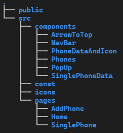

# Phones API - React client

## Intro

In this document I will explain the steps I followed and the decisions I made in order to complete the React client code challenge, so this README puts its focus in the frontend part of the challenge.

Also, it is important to mentioned this React app is deployed in Netlify at [https://pedantic-edison-cb7c0d.netlify.app/](https://pedantic-edison-cb7c0d.netlify.app/) so if you don't want to configure it locally you can skip that part.

## 1. Configure

There is not much configuration to be done as all this is managed by the Create React App scripts, wchic are explained later (I kept that part from the template as it is very well explained).

The only thing you could configure is to change the API URL which in the repo points to PROD in Heroku, if you want to test it locally, you will need to update that, which can be located in the `/src/const/apiUrl.js` file.

### Getting Started with Create React App

This project was bootstrapped with [Create React App](https://github.com/facebook/create-react-app).

### Available Scripts

In the project directory, you can run:

#### `npm start`

Runs the app in the development mode.\
Open [http://localhost:3000](http://localhost:3000) to view it in the browser.

The page will reload if you make edits.\
You will also see any lint errors in the console.

#### `npm test`

Launches the test runner in the interactive watch mode.\
See the section about [running tests](https://facebook.github.io/create-react-app/docs/running-tests) for more information.

#### `npm run build`

Builds the app for production to the `build` folder.\
It correctly bundles React in production mode and optimizes the build for the best performance.

The build is minified and the filenames include the hashes.\
Your app is ready to be deployed!

See the section about [deployment](https://facebook.github.io/create-react-app/docs/deployment) for more information.

#### `npm run eject`

**Note: this is a one-way operation. Once you `eject`, you can’t go back!**

If you aren’t satisfied with the build tool and configuration choices, you can `eject` at any time. This command will remove the single build dependency from your project.

Instead, it will copy all the configuration files and the transitive dependencies (webpack, Babel, ESLint, etc) right into your project so you have full control over them. All of the commands except `eject` will still work, but they will point to the copied scripts so you can tweak them. At this point you’re on your own.

You don’t have to ever use `eject`. The curated feature set is suitable for small and middle deployments, and you shouldn’t feel obligated to use this feature. However we understand that this tool wouldn’t be useful if you couldn’t customize it when you are ready for it.

## 2. Project structure and libraries used

As you can see in the image, the structure of the project is as follows:

- `public` folder which contains the `_redirects` file or the main `index.html`.
- `src` folder is the main folder of the project. In the root of this folder you can find the `index.js` and `App.js` files which Create React App configures. In here you will find the following:
  - `components` folder which has all the components and its styles, which I will explain later. Inside each component folder you can find an `index.js` file which contains the actual component and another `index.scss` with the styles.
  - `const` folder contains the `apiUrl` constant
  - `icons` where you will see al the `.svg` and `.png` files I've used in the project.
  - `pages` contains all the main pages of the project, which are three: a home page, a single phone page (info about a single phone) and an add phone page.

Regarding libraries, I have used:

- `react-router-dom` in order to crate a PWA with routes.
- `react-hook-form` to manage the add phone and edit phone forms.
- `react-infinite-scroll-component` as an infinite scroll in the main page, to load more phones when scrolling down.
- `react-scrolltop-button` to create a button to scroll back to the top of the page.
- `sass` to style the components and pages.

All this information can be seen in the `package.json` file.

## 3. Components explanation

In the application you can find the following components:

1. `ArrowToTop`, this component is only the arrow you can see inside the scroll to top button, which I created using [SVGR](https://react-svgr.com/playground/), transforming a svg to a React component.
2. `NavBar` is the nav bar component, with two links redirecting to the home page or the add phone page.
3. `PhoneDataAndIcon` is a small component in order to create the combination of text and icon for each feature of a phone. For instance, the storage will show an icon and some text. Both of this things are received by this component as props to display them.
4. `Phones` is the a component to arrange the picture and name of the phones in order to display them in the home page. Each phone you see in this page is using this component when the phones array is being mapped, passing the data as a prop.
5. `PopUp` is the component used in order to display information about errors when calling the API or even the message that is shown when trying to delete a phone, in order to confirm the action. You can pass different props to this components depending on the text you need to display or the number of buttons and its actions.
6. `SinglePhoneData` arranges the information about a single phone, and contains several `PhoneDataAndIcon` components, each of them having a single piece of information.
